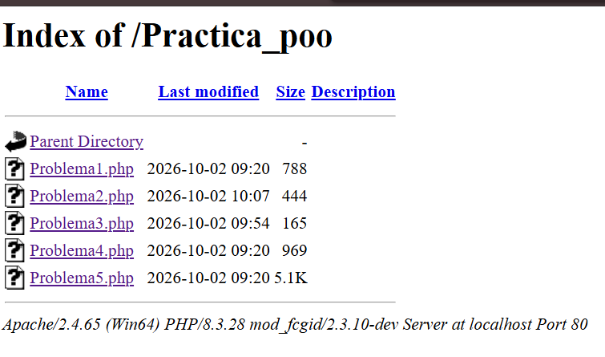
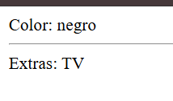
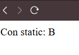
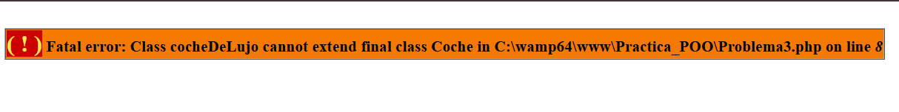
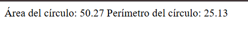
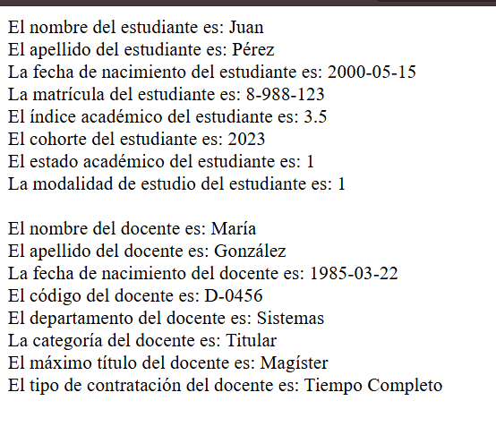

# Practica-POO

## Objetivo

Aplicar los conceptos de la Programación Orientada a Objetos en PHP (clases, herencia, encapsulamiento, clases `final`, métodos estáticos con *Late Static Binding* y constructores) mediante cinco problemas prácticos, cada uno contenido en un solo archivo y sin usar base de datos.

---

## Detalles del Laboratorio

| Campo | Detalle |
| ----- | ------- |
| **Universidad** | Universidad Tecnológica de Panamá — Facultad de Ingeniería de Sistemas Computacionales |
| **Curso** | Desarrollo Web |
| **Laboratorio** | Práctica de POO en PHP |
| **Instructor** | Ing. Irina Fong |

**Problemas desarrollados:**

1. Herencia entre `Coche` y `CocheDeLujo`.
2. Late Static Binding: comparación entre `static::` y `self::`.
3. Clase `final`: impedir que una clase pueda heredarse.
4. Clase `Circulo`: cálculo del área y el perímetro.
5. Clases `Persona`, `Estudiante` y `Docente` con herencia.

---

## Tecnologías y Versiones

| Tecnología | Versión |
| ---------- | ------- |
| PHP | 8.3.28 |
| Servidor web | Apache 2.4.65 (Win64) |
| WampServer | 64-bit |
| mod_fcgid | 2.3.10-dev |
| Editor | Visual Studio Code |
| Control de versiones | Git / GitHub |
| Sistema Operativo | Windows |

---

## Estructura de Carpetas

```
Practica_POO/
├── assets/            # Capturas de pantalla del README
├── Problema1.php      # Herencia: Coche y CocheDeLujo
├── Problema2.php      # Late Static Binding: static vs self
├── Problema3.php      # Clase final
├── Problema4.php      # Clase Circulo
├── Problema5.php      # Persona, Estudiante y Docente
└── README.md
```

---

## Proceso de Instalación

### 1. Clonar o copiar el proyecto

```
git clone <URL-del-repositorio>
```

O copiar la carpeta `Practica_POO/` dentro del directorio web de WAMP:

```
C:\wamp64\www\Practica_POO\
```

### 2. Iniciar los servicios

Abrir WampServer y verificar que el ícono esté en **verde** (Apache y PHP activos).

### 3. Abrir el sistema

```
http://localhost/Practica_POO/
```

Seleccionar cada archivo (`Problema1.php` ... `Problema5.php`) para ver su resultado.

> No requiere composer, npm ni base de datos. También se puede ejecutar desde la terminal con `php Problema1.php`.

---

## Controles Utilizados

### Elementos de POO

| Elemento | Uso |
| -------- | --- |
| `class` | Definición de las clases |
| `extends` | Herencia entre clases (Problemas 1, 3 y 5) |
| `final` | Impide que la clase sea heredada (Problema 3) |
| `protected` / `private` | Encapsulamiento de los atributos |
| `__construct()` | Constructor de las clases (Problemas 4 y 5) |
| `parent::__construct()` | Llama al constructor de la clase padre (Problema 5) |
| `public static function` | Métodos estáticos (Problema 2) |
| `static::` | Late Static Binding: se resuelve en tiempo de ejecución |
| `self::` | Se resuelve en la clase donde fue escrito el código |
| Getters / Setters | Acceso controlado a los atributos |

### Funciones y constantes de PHP

| Función / Constante | Propósito |
| ------------------- | --------- |
| `echo` | Muestra los resultados en pantalla |
| `__CLASS__` | Devuelve el nombre de la clase actual (Problema 2) |
| `M_PI` | Constante matemática π (Problema 4) |
| `number_format()` | Da formato a los decimales (Problema 4) |

---

## Evidencia de Ejecución

### 1. Estructura de la carpeta en el servidor

Carpeta `Practica_POO` en WampServer con los cinco archivos de los problemas.



### 2. Problema #1: Herencia

`CocheDeLujo` hereda de `Coche`, agrega el atributo `extras` y sobrescribe `printCaracteristicas()`. Muestra el color, una línea horizontal y los extras.



### 3. Problema #2: Late Static Binding (`static` vs `self`)

| Llamada | Resultado | Explicación |
| ------- | --------- | ----------- |
| `static::miFuncion()` | **B** | Usa la clase que hizo la llamada (se resuelve en ejecución) |
| `self::miFuncion()` | Clase padre (**A**) | Siempre apunta a la clase donde está escrito el código |



### 4. Problema #3: Clase `final`

Al intentar que `cocheDeLujo` herede de la clase `final Coche`, PHP genera un **error fatal**. Este error es el resultado esperado del ejercicio.



### 5. Problema #4: Clase Círculo

Con radio 4, la clase calcula un área de **50.27** y un perímetro de **25.13**.



### 6. Problema #5: Persona, Estudiante y Docente

`Estudiante` y `Docente` heredan de `Persona` y agregan sus propios datos. El estado académico usa 0 inactivo, 1 activo, 2 retirado y 3 graduado; la modalidad usa 1 presencial, 2 virtual y 3 híbrida.



---

## Evidencia de Acciones de Modificar

No aplica en este laboratorio. La práctica no utiliza base de datos, por lo que no existe una acción de modificar registros.

---

## Evidencia de Acciones de Eliminar

No aplica en este laboratorio. Al no existir base de datos, no se implementó una acción de eliminar registros.

---

## Dificultades y Soluciones

**Problema 1: Error fatal en el Problema 3**

> Al abrir `Problema3.php` aparece *"Class cocheDeLujo cannot extend final class Coche"*.

**Solución:** No es un fallo del código. Es el comportamiento esperado de una clase `final`, que no puede heredarse. El error es la evidencia del ejercicio.

---

**Problema 2: El resultado del círculo salía en una sola línea**

> Los saltos de línea `\n` no se ven en el navegador porque HTML los ignora.

**Solución:** Usar `<br>` en lugar de `\n`, o ejecutar el archivo desde la terminal con `php Problema4.php`.

---

**Problema 3: `$this->getColor` sin paréntesis**

> En `Coche::printCaracteristicas()`, `getColor` se escribió como si fuera una propiedad y no un método.

**Solución:** Llamarlo como método: `$this->getColor()`.

---

**Problema 4: El `include("Persona.php")` en el Problema 5**

> Cada problema debía quedar en un solo archivo, por lo que `Estudiante` no podía incluir `Persona.php`.

**Solución:** Declarar `Persona`, `Estudiante` y `Docente` en el mismo archivo y quitar los `include`.

---

## Referencias

- [PHP: Clases y Objetos](https://www.php.net/manual/es/language.oop5.php)
- [PHP: Herencia](https://www.php.net/manual/es/language.oop5.inheritance.php)
- [PHP: Palabra clave final](https://www.php.net/manual/es/language.oop5.final.php)
- [PHP: Late Static Bindings](https://www.php.net/manual/es/language.oop5.late-static-bindings.php)
- [PHP: number_format](https://www.php.net/manual/es/function.number-format.php)
- [WampServer](https://www.wampserver.com)

---

## Fecha de Ejecución

8 de octubre de 2026

---

| | |
| -- | -- |
| **Nombre** | Irving S. Cruz |
| **Curso** | Desarrollo Web |
| **Instructor** | Ing. Irina Fong |